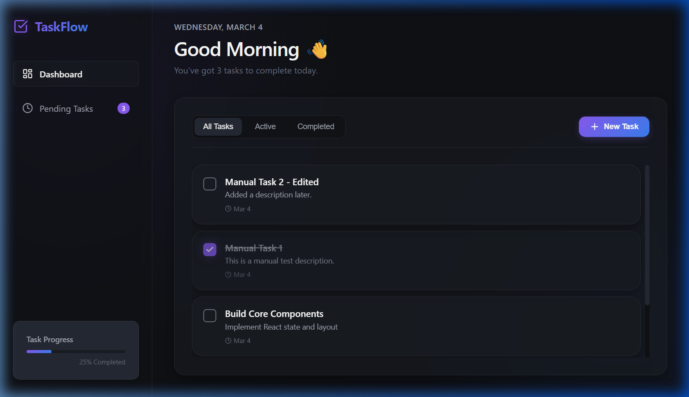
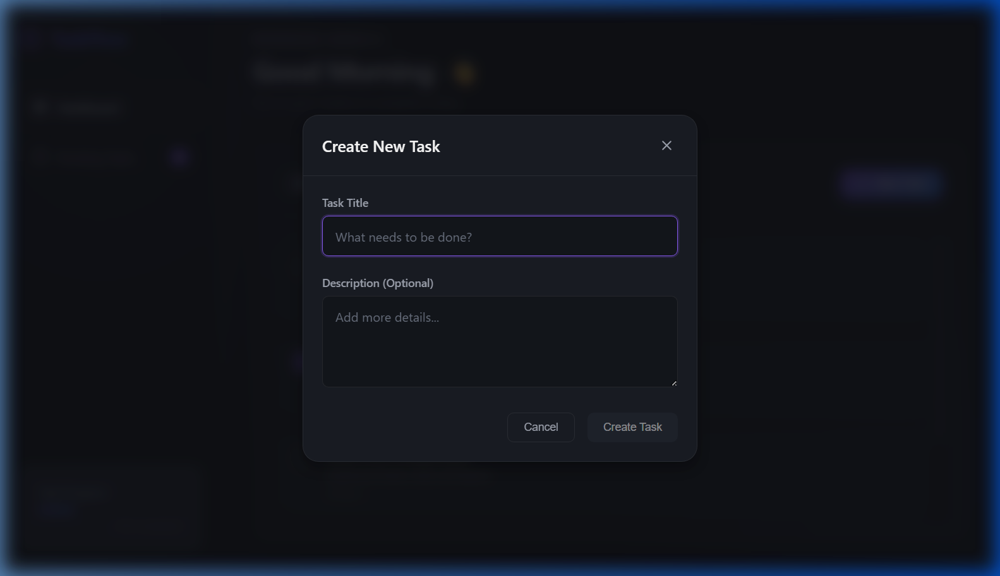
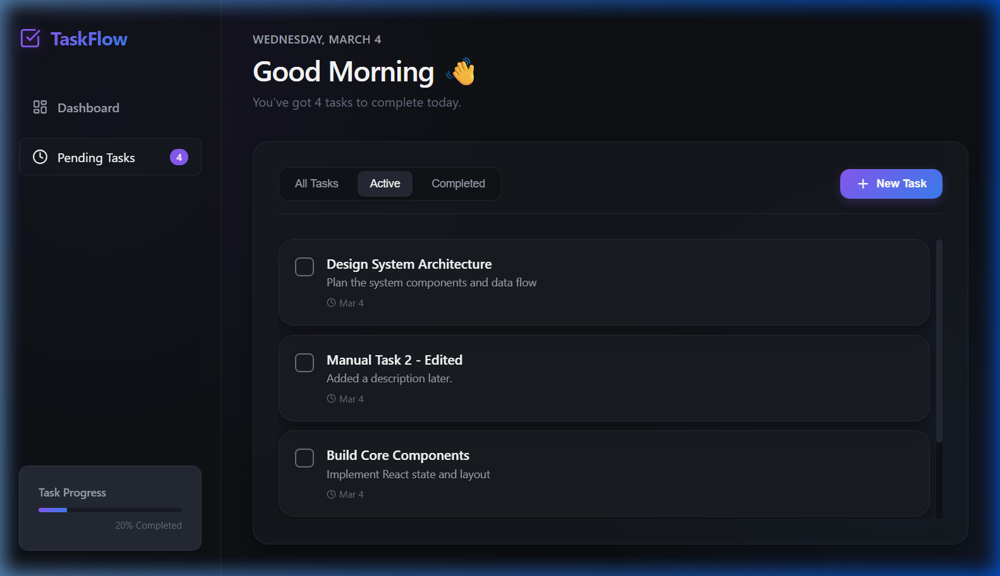

# ✅ TaskFlow — Premium Task Manager

A modern, feature-rich task manager web application built with **React** and **Vite**, featuring a stunning glassmorphism dark-mode UI with smooth animations.



---

## ✨ Features

- **Create, Edit & Delete Tasks** — Full task lifecycle management via a polished modal dialog
- **Task Completion Toggling** — One-click checkbox to mark tasks as done (with strikethrough animation)
- **Smart Filtering** — Filter tasks by All, Active, or Completed via tab buttons or the sidebar
- **Real-time Progress Tracking** — Progress bar and percentage counter update live as you complete tasks
- **LocalStorage Persistence** — Tasks are saved in the browser so they survive page refreshes
- **Fully Responsive** — Works beautifully on desktop and mobile devices

---

## 📸 Screenshots

### Dashboard


### Create a New Task


### Active Tasks Filter


---

## 🛠️ Tech Stack

| Technology | Purpose |
|---|---|
| [React 18](https://react.dev/) | UI Framework |
| [Vite](https://vitejs.dev/) | Build tool & Dev server |
| [Lucide React](https://lucide.dev/) | Icon library |
| CSS Variables + Glassmorphism | Design system |
| localStorage API | Data persistence |

---

## 🚀 Getting Started

### Prerequisites
- [Node.js](https://nodejs.org/) (v18 or higher)

### Installation

1. **Clone the repository:**
   ```bash
   git clone https://github.com/KartikAdlakhia/Task_Manager.git
   cd Task_Manager
   ```

2. **Install dependencies:**
   ```bash
   npm install
   ```

3. **Start the development server:**
   ```bash
   npm run dev
   ```

4. Open your browser and navigate to `http://localhost:5173`

---

## 📁 Project Structure

```
task-manager/
├── src/
│   ├── components/
│   │   ├── TaskItem.jsx       # Individual task card
│   │   ├── TaskItem.css
│   │   ├── TaskList.jsx       # Task list with filter tabs
│   │   ├── TaskList.css
│   │   ├── TaskModal.jsx      # Create/Edit task modal
│   │   └── TaskModal.css
│   ├── hooks/
│   │   └── useTasks.js        # Custom hook for task state & localStorage
│   ├── App.jsx                # Root component
│   ├── App.css                # Layout styles
│   └── index.css              # Global design tokens & theme
├── screenshots/               # App screenshots for README
└── package.json
```

---

## 📄 License

This project is open source and available under the [MIT License](LICENSE).
